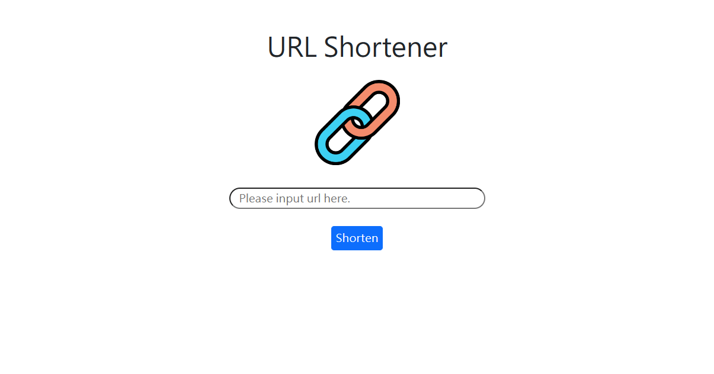

# URL Shortener



## 介紹

可輸入您想縮短的網址，並點擊Shorten按鈕轉換為短網址，如想複製，可以點擊複製圖示。

## 功能

- 縮短網址
- 若輸入同個長網址，將輸出同個短網址

## 使用說明

1.  請確認是否有安裝 Node.js 及 npm
2.  請下載本專案或是clone至本端
```
git clone https://github.com/RaynaLin/url_shortener.git
```
3.  安裝完畢後，開啟專案
```
npm run dev
```
4.  若看見此行訊息則代表順利運行，打開瀏覽器進入到以下網址
```
App is running on http://localhost:3000
```
5.  若欲暫停使用
```
ctrl + c
```

## 開發工具

- Node.js 16.17.0
- Express 4.17.1
- Express-Handlebars 4.0.2
- Bootstrap 4.3.1
- MongoDB
- mongoose 5.9.7
